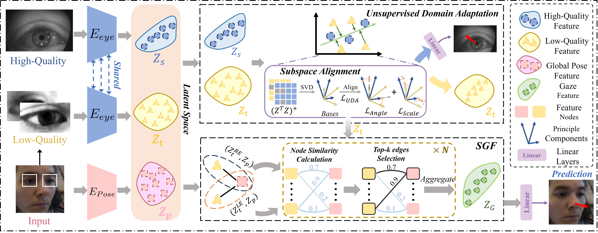
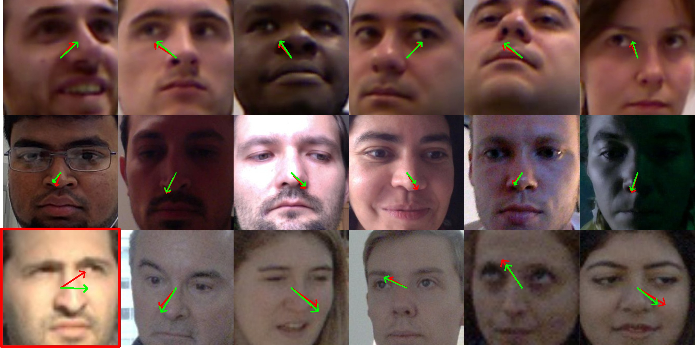
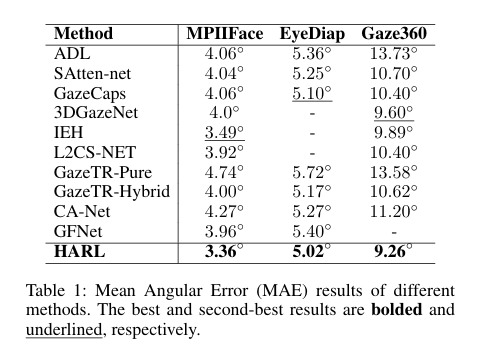
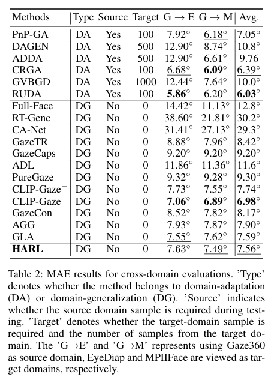

# Hybrid-Domain Adaptative Representation Learning for Gaze Estimation(*HARL*)

Official implementation of the paper "Hybrid-Domain Adaptative Representation Learning for Gaze Estimation" (*2026 AAAI*).



## Results

### Visualized Predicted Results



### In-Domain Evaluation



### Cross-Domain Evaluation



## Installation

We provide installation environment:
```
# Training environment
conda create -n harl python=3.10
conda activate harl
pip install -r requirements.txt
```

## Pose Extractor

You can download the pretrained weight for pose extractor [here](https://github.com/jhb86253817/PIPNet).

## Training
We will release the training code soon.

## Evaluation

You can perform cross-domain evaluation by following command:

```
python test.py
```

## Citation

if our work assits your research, feel free to give us a star or cite us using:

```
@inproceedings{tan2025hybrid,
  title={Hybrid-Domain Adaptative Representation Learning for Gaze Estimation},
  author={Tan, Qida and Yang, Hongyu and Du, Wenchao},
  booktitle={Proceedings of the AAAI Conference on Artificial Intelligence},
  year={2026}
}
```

## Contact us 
For any questions, please feel free to contact us at: tanqida@stu.scu.edu.cn